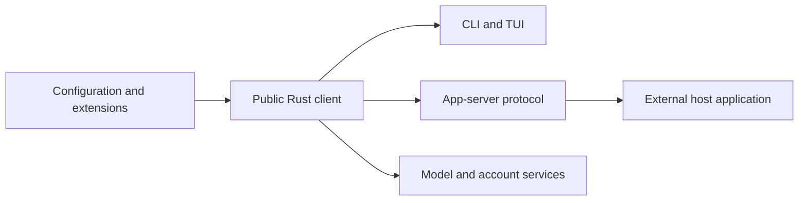

# Codex 0.154.0-next

Source fork with a locally assembled and smoke-tested package. It has not been
installed or released. See the
[customization matrix](customization-matrix.md), [change ledger](change-ledger.md),
and [operator guide](operator-guide.md).

## Provenance

- Baseline: upstream `6b9826e3aa83b1a5947db50f4332cb9c65f1b340`.
- Development branch: `next/0.154.0`.
- Existing fork `main`: `ee6814bfa4889fe9b2b3dcc9cc8bdd91effa8ab8`, preserved.
- Issue search cutoff: reports created through 2026-09-14 UTC. Search results
  are candidates, not confirmed defects. A search page is not complete coverage.
- Package version: `0.154.0-next`. The assembled package manifest carries this
  version; the embedded CLI reports the pinned workspace identity, `0.154.0`.

## Ownership boundaries

Configuration affects client behavior within the implemented permission and
capability checks. A public client patch cannot guarantee Desktop rendering,
model behavior, subscription accounting, encrypted-content availability, or
backend entitlement. Feature stability and default enablement are independent
of ownership and of demonstrated runtime success.

## Installation gate

Do not switch the default launcher until the modified package, its helper
binaries, compatibility checks, and rollback have been verified. Do not replace
Desktop application binaries. Do not change live configuration to compensate
for an unverified build.

The original Bun launcher and installed binaries remain in place. Local build
logs and packages are kept outside this repository under
`~/.local/state/codex-next/`; they must not be copied into a published branch.
That directory contains evidence, not a replacement for native execution state.

See the [change ledger](change-ledger.md) for actual checks and limitations.
