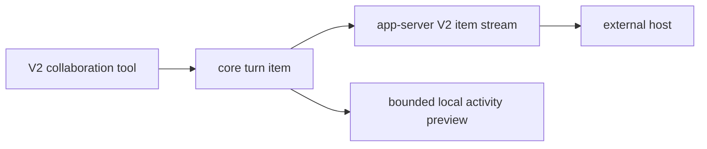

# Operator guide

## Build and smoke check

From the repository root, use Rust 1.95.0 and the repository's verified V8
archive and binding pair. Generate app-server fixtures with
`codex-rs/app-server-protocol/scripts/write_schema_fixtures.py`, then run
focused checks for `codex-features`, `codex-core`, `codex-app-server-protocol`,
and `codex-tui`, followed by the complete `just test` suite. The pinned
`just write-app-server-schema` recipe currently names a missing binary, so it
is not an equivalent generator until that baseline recipe is repaired.

## Operational behavior

Fast mode is off when `features.fast_mode` is omitted. Set it to `true` only
for an intentional opt-in; the local harness keeps it explicitly `false` in
base, profile, and role configuration.

For `/subagents`, the local TUI uses the existing lifecycle and lineage data,
and its activity preview is capped at six summaries, 240 graphemes each, and
three rendered lines. Reconnect/replay uses item identity deduplication. The
daemon-wide surface is the existing app-server item stream, which includes
lifecycle, sender/receiver lineage, operation status, requested and resolved
settings when observable, and activity events. It never publishes encrypted
communication or hidden reasoning.

## Package and rollback

The local smoke package is `0.154.0-next`; `codex --version` identifies the
pinned CLI as `0.154.0`. Direct smoke checks cover the CLI, bundled search
helper, code-mode host, strict app-server configuration loading,
initialization, `thread/list`, and the daemon-wide `agents` interface. The
package has not replaced a launcher, been installed, or been released.

## Rollback

Keep the original Bun launcher and installed package path before replacing any
launcher. To roll back this source change, restore the reviewed core,
protocol, TUI, generated schema, and documentation files together, then rerun
the focused checks. Do not modify Desktop binaries, credentials, transcripts,
or service configuration as part of this rollback.
